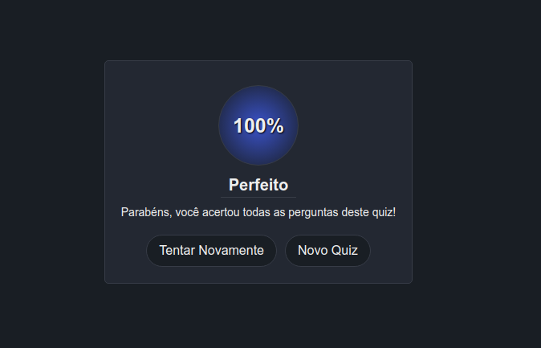

<h1 align="center">Quiz</h1>

## Sobre o Projeto
O projeto original é de autoria da B7Web, e a vídeo-aula mostrando como desenvolver o projeto base pode ser encontrada [aqui](https://alunos.b7web.com.br/curso/javascript/d7js-projeto-6-quiz).

Todo o **HTML**, **CSS**  e **JavaScrip** foi desenvolvido por conta própria, apenas visualizando o comportamento do projeto no início da vídeo-aula.

Assim, as diferenças deste projeto para aquele desenvolvido na vídeo-aula são:
- Tela inicial para seleção de quiz.
- Implementação de diferentes quizes no projeto.
- Animações em geral.

## Como utilizar

### Abrindo o arquivo
Uma vez que o projeto utiliza apenas de HTML, CSS e JavaScript, basta o usuário abrir o arquivo **index.html** em um navegador, que tela da bateria será carregada.

O termo **modelo de B7Web** é clicável, e redireciona para a vídeo-aula do projeto.

### Escolhendo um quiz
Como apresentado na imagem anterior, basta o usuário **clicar** em um dos card para começar seu quiz. Informações como *total de questões* e *sobre* estão presentes no card.

### Jogando

Para jogar, basta o usuário **clicar** na opção que achar correta, de acordo com a pergunta. Feito isso, ao conjunto de pergunta-respostas desaparecerá, dando lugar ao próximo conjunto. A medida que as perguntas forem sendo respondidas, a barra de progresso no **topo da página** aumentará. Quando a barra percorrer toda a largura da tela, o quiz estará finalizado.

### Resultados

Uma vez respondida todas as perguntas, a tela com o resultado do usuário aparecerá, contendo as informações de seu desempenho e dois botões:
- O botão **Tentar Novamente** reinicia o quiz atual da primeira pergunta.
- O botão **Novo Quiz** retorna para a tela de seleção de quiz.
 
